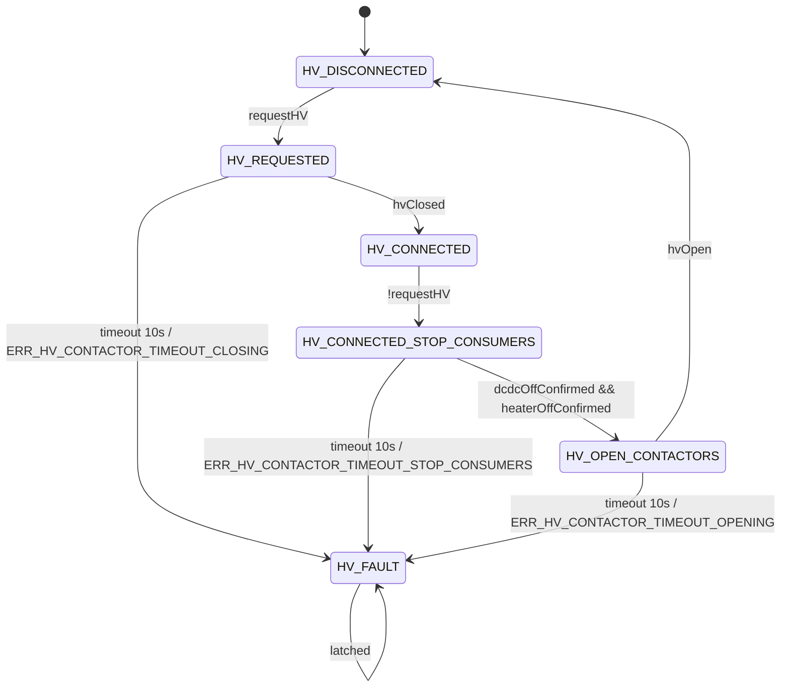

# HVCM State Machine Analysis

## Scope
This document analyzes the `HvContactorManager` state machine implemented in `include/lvdu.h` (around `HvContactorManager::Update()`).

## State Variables
- `requestHV` (`bool`): Desired HV intent written by LVDU via `SetHVRequest(bool)`.
- `state` (`HvContactorManager::State`): Current HVCM state.
- `stateTimeoutCounter` (`uint16_t`): Per-state timeout counter, reset on state changes.

## Input Parameters Read By HVCM
- `BMS_DataValid` -> `bmsValid`
- `BMS_CONT_State` -> `contState`
- `dcdc_input_power_off_confirmed` -> `dcdcOffConfirmed`
- `heater_off_confirmed` -> `heaterOffConfirmed`

Derived local signals:
- `hvClosed = bmsValid && (contState == 4)`
- `hvOpen = bmsValid && (contState == 1)`

## Output Parameters Written By HVCM
- `HVCM_to_bms_hv_request` (`1` only in `HV_REQUESTED`, `HV_CONNECTED`, `HV_CONNECTED_STOP_CONSUMERS`)
- `HVCM_state` (numeric enum state)

## States
- `HV_DISCONNECTED`
- `HV_REQUESTED`
- `HV_CONNECTED`
- `HV_CONNECTED_STOP_CONSUMERS`
- `HV_OPEN_CONTACTORS`
- `HV_FAULT`

## Transition Triggers (Complete List)

### From `HV_DISCONNECTED`
- `requestHV == true` -> `HV_REQUESTED`
- otherwise stays `HV_DISCONNECTED`

### From `HV_REQUESTED`
- `hvClosed == true` -> `HV_CONNECTED`
- else increments timeout counter
- if timeout reaches `LVDU_HV_CONTACTOR_TIMEOUT_STEPS` (100 @ 100 ms = 10 s):
  - post `ERR_HV_CONTACTOR_TIMEOUT_CLOSING`
  - -> `HV_FAULT`

### From `HV_CONNECTED`
- `requestHV == false` -> `HV_CONNECTED_STOP_CONSUMERS`
- otherwise stays `HV_CONNECTED`

### From `HV_CONNECTED_STOP_CONSUMERS`
- `dcdcOffConfirmed && heaterOffConfirmed` -> `HV_OPEN_CONTACTORS`
- else increments timeout counter
- if timeout reaches 10 s:
  - post `ERR_HV_CONTACTOR_TIMEOUT_STOP_CONSUMERS`
  - -> `HV_FAULT`

### From `HV_OPEN_CONTACTORS`
- `hvOpen == true` -> `HV_DISCONNECTED`
- else increments timeout counter
- if timeout reaches 10 s:
  - post `ERR_HV_CONTACTOR_TIMEOUT_OPENING`
  - -> `HV_FAULT`

### From `HV_FAULT`
- no transition logic (latched)

## Mermaid State Diagram

## Bugs / Risks Found

1. `STATE_HV_CONNECTING` in LVDU does not handle HVCM fault state.
- In `LVDU::UpdateState()`, `STATE_HV_CONNECTING` only checks for `HVCM_state == HV_CONNECTED`.
- If HVCM enters `HV_FAULT`, LVDU can remain stuck in `STATE_HV_CONNECTING` indefinitely.

2. Manual standby mode can bypass HV opening logic.
- In manual standby branch, LVDU transitions directly to `STATE_STANDBY` and returns early.
- `hvManager.SetHVRequest(false)` is not issued there.
- Existing code even includes `//Todo what if we are coming from a HV active state ?`
- Result risk: system may report standby while HVCM still keeps HV requested/connected.

3. `HV_FAULT` is fully latched with no recovery path.
- There is no transition out of `HV_FAULT` in HVCM.
- If this is intentional, it should be documented and paired with a clear reset strategy.
- If not intentional, this is a functional lockup after any timeout fault.

## Suggested Fix Directions
- In `STATE_HV_CONNECTING`, explicitly handle `HVCM_state == HV_FAULT` and transition to `STATE_ERROR`.
- In manual standby override branch, ensure HV request is explicitly withdrawn and/or force transition through HV disconnect path.
- Decide and implement a deliberate recovery strategy for `HV_FAULT` (explicit clear condition or power-cycle requirement).
