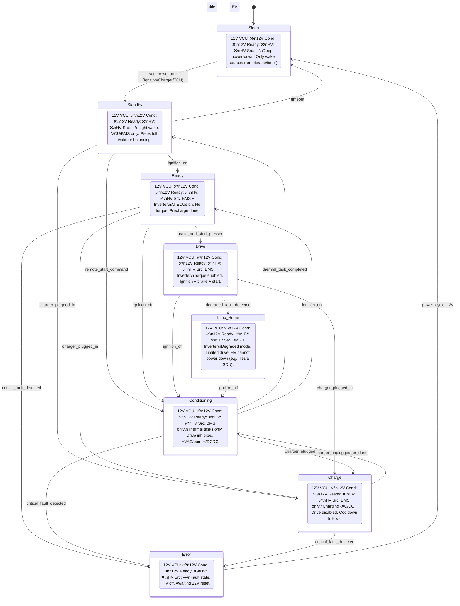

## ⚙️ EV State Descriptions and Subsystem Activity

| **State**        | **12V VCU** | **12V Conditioning** | **12V Ready** | **HV Active** | **HV Source**      | **Description**                                                                 |
|------------------|-------------|----------------------|---------------|---------------|--------------------|---------------------------------------------------------------------------------|
| 🔋 **Sleep**       | ❌          | ❌                   | ❌            | ❌            | —                  | Deep power-down mode. All systems off except wake sources (remote key, app, timer). Merges OFF state functionality. |
| 🟣 **Standby**     | ✅          | ❌                   | ❌            | ❌            | —                  | Light wake-up mode. Only VCU and BMS active. HV off. Used for battery balancing, low-power monitoring, or prepping full wake-up. May return to Sleep if inactive. |
| 🟡 **Ready**       | ✅          | ✅                   | ✅            | ✅            | BMS + Inverter     | Full wake-up mode. Ignition ON, HV precharge complete. All ECUs operational. Prepares for driving, charging, or thermal control. No torque allowed yet. |
| ❄️ **Conditioning** | ✅          | ✅                   | ❌            | ✅            | BMS only           | HV active. Drive inhibited. Supports preconditioning, post-drive cooling, or battery thermal management. Involves HVAC, pumps, and DCDC. Can start with or without ignition. |
| 🚗 **Drive**       | ✅          | ✅                   | ✅            | ✅            | BMS + Inverter     | Full driving mode. Torque delivery enabled. Requires ignition ON, brake pressed, and completed start sequence. |
| ⚡ **Charge**      | ✅          | ✅                   | ❌            | ✅            | BMS only           | Charging via AC or DC. Drive disabled. On finish, system exits to Conditioning for cooling. |
| ⚠️ **Error**       | ✅          | ❌                   | ❌            | ❌            | —                  | Fault state. HV and torque disabled. Awaiting 12V power cycle to reset and reboot safely. |
| 🛠️ **Limp Home**   | ✅          | ✅                   | ✅            | ✅            | BMS + Inverter     | Degraded fault state. HV and limited drive allowed. Used when faults permit continued low-performance operation. Can exit to Conditioning. Important, because Tesla SDU does't allow HV power of.|

---

> **Note:** Each state defines the operational context for the EV system. Transitions depend on user interaction (e.g., ignition), remote signals (e.g., app), or system events (e.g., thermal task completion, charger status, fault detection).

## ✅ Signal Descriptions

| **Signal / Event**          | **Description**                                                                                     |
|-----------------------------|-----------------------------------------------------------------------------------------------------|
| **`vcu_power_on`**          | Triggered by ignition key turn, charger plug-in, or TCU wake-up command; powers the VCU and transitions the vehicle from deep sleep (Sleep) to Standby. |
| **`timeout`**               | No ignition or user interaction within a defined time window; system transitions back from Standby to Sleep to conserve power. |
| **`ignition_on`**           | User activates ignition via key or start button; transitions vehicle from Standby or Conditioning to Ready (full HV precharged). |
| **`ignition_off`**          | Ignition is turned off by the user; initiates cool-down procedures and transitions from Ready, Drive, or Limp Home to Conditioning. |
| **`remote_start_command`**  | Mobile app or scheduled wake command triggers preconditioning; used to move from Standby to Conditioning without driver interaction. |
| **`brake_and_start_pressed`** | Driver-initiated drive request; pressing brake and start simultaneously while in Ready enables transition to Drive (torque delivery allowed). |
| **`charger_plugged_in`**    | Valid AC or DC charger is connected and handshake succeeds; initiates charging from Standby, Ready, Drive, or Conditioning. |
| **`charger_unplugged_or_done`** | Charger unplugged or charging process finishes; triggers post-charge cooling by transitioning from Charge to Conditioning. |
| **`thermal_task_completed`**| HVAC, battery heating, or cooling tasks are finished; system exits Conditioning and transitions to Standby. |
| **`critical_fault_detected`** | System detects a severe safety issue (e.g., HV isolation breach, inverter failure); forces transition to Error from Ready, Conditioning, or Charge. |
| **`degraded_fault_detected`** | A recoverable issue (e.g., thermal limit, minor sensor failure) occurs during driving; allows fallback from Drive to Limp Home for limited mobility. |
| **`power_cycle_12v`**       | Manual reset of 12V system (disconnect/reconnect battery); required to exit Error state and re-enter Sleep. |

---

> **Note**: These signals are evaluated by the vehicle’s VCU and safety layer. Some transitions also depend on system status (e.g., precharge success, HV enable conditions).

# 🔁 EV State Transition Matrix

This matrix defines all valid transitions between vehicle states in the EV state machine, based on signal conditions and system behavior.

| **From \ To**    | Sleep | Standby | Ready | Conditioning | Drive | Charge | Error | Limp Home |
|------------------|:-----:|:-------:|:-----:|:------------:|:-----:|:------:|:-----:|:---------:|
| **Sleep**        | —     | ✅ *(VCU Power-On: Ignition/Charger/TCU)* | ⛔    | ⛔    | ⛔    | ⛔    | ⛔    | ⛔        |
| **Standby**      | ✅ *(timeout)* | —     | ✅ *(Ignition ON)* | ✅ *(remote_start_command)* | ⛔    | ✅ *(Charger plugged in)* | ⛔    | ⛔        |
| **Ready**        | ⛔    | ⛔      | —     | ✅ *(Ignition OFF)* | ✅ *(Brake + Start)* | ✅ *(Charger plugged in)* | ✅ *(Critical fault detected)* | ⛔        |
| **Conditioning** | ⛔    | ✅ *(Thermal task completed)* | ✅ *(Ignition ON)* | —     | ⛔    | ✅ *(Charger plugged in)* | ✅ *(Critical fault detected)* | ⛔        |
| **Drive**        | ⛔    | ⛔      | ⛔    | ✅ *(Ignition OFF)* | —     | ✅ *(Charger plugged in)* | ⛔    | ✅ *(Degraded fault detected)* |
| **Charge**       | ⛔    | ⛔      | ⛔    | ✅ *(Charger unplugged or done)* | ⛔    | —     | ✅ *(Critical fault detected)* | ⛔        |
| **Error**        | ✅ *(Power cycle 12V)* | ⛔ | ⛔    | ⛔    | ⛔    | ⛔     | —     | ⛔        |
| **Limp Home**    | ⛔    | ⛔      | ⛔    | ✅ *(Ignition OFF)* | ⛔    | ⛔     | ⛔    | —         |

---

## 📝 Legend

- ✅ = Valid transition (with triggering signal/event in parentheses)
- ⛔ = Invalid transition
- — = No transition (same state)

